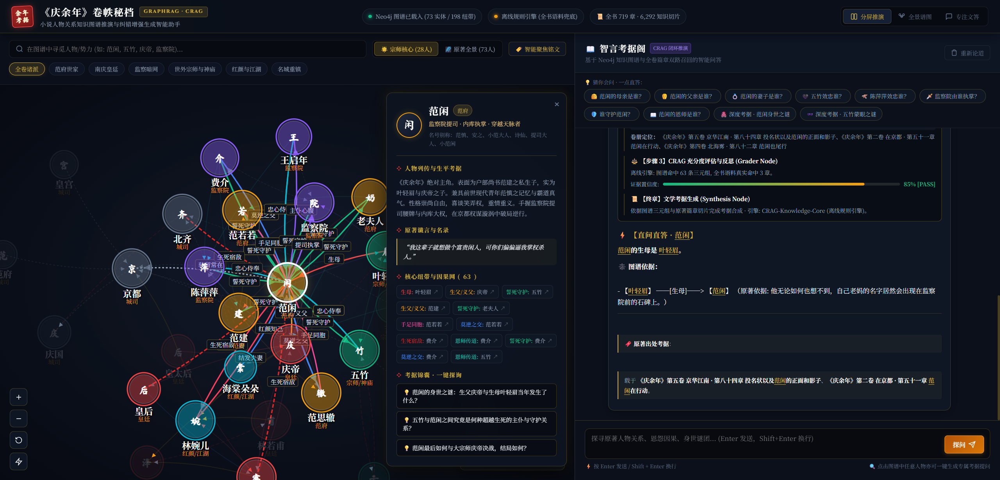

# 《庆余年》GraphRAG · CRAG 智能考据阁

[](https://www.python.org/downloads/)
[](https://github.com/langchain-ai/langgraph)
[](https://fastapi.tiangolo.com/)
[](https://neo4j.com/)
[](LICENSE)

以猫腻《庆余年》全书七卷（719 章）为语料，构建的**人物关系知识图谱 + 矫正检索增强生成（CRAG）智能问答系统**。
左侧是一张可交互的势力关系星图，右侧是一位有据可查的"考据掌阁学士"——每个回答都展示完整的 CRAG 推演链路，并锚定真实原著章节。



## ✨ 功能特性

### 🕸️ 交互式关系图谱
- **防重叠环形布局**：主角居中、同阵营聚簇成色块，环容量按弦长公式计算，任意视图下节点**零重叠**（数值验证：核心 28 节点 / 全景 73 节点，最小间距余量 ≥ 29%）
- **六大便服阵营染色**：范府世家 / 南庆皇廷 / 监察暗网 / 世外宗师与神庙 / 红颜与江湖 / 名城重镇与司部
- **智能聚焦**：点击节点高亮邻居、点亮关系铭文，其余淡出；支持缩放、拖拽、搜索定位
- **双密度视图**：宗师核心（28 人精粹）⇄ 原著全景（73 实体 / 198 连线），人数由实际数据动态计算

### ⚡ 双引擎 CRAG 问答（自动切换）
| | LangGraph 闭环引擎 | 离线规则引擎 |
|---|---|---|
| 触发条件 | Ollama 可达时自动启用 | Ollama 离线或管线异常时自动降级 |
| 推理 | Ollama 本地 LLM（qwen3:4b） | 规则模板 + 图谱三元组合成 |
| 检索 | FAISS 向量 + Neo4j 图谱双路召回 + bge-reranker 精排 | 图谱三元组 + 全书 719 章全语料关键词检索 |
| 兜底 | 本地 2 轮改写重试 → Tavily 联网搜索 | 如实说明"未能定位章节"，绝不编造引用 |

- **⚡ 直问直答**："范闲的母亲是谁？"这类事实型问题，直接从图谱三元组给出规范答案（**范闲的生母是 叶轻眉。**），附关系依据与真实章节引用
- **🎭 多轮对话记忆**：LangGraph MemorySaver 按 session_id 保存会话，支持指代消解（"他的母亲是谁？"）
- **📜 真实章节引用**：所有引用来自实际命中的章节，检索不到时如实说明
- **🔍 推演全链路可视化**：每次回答展示 Memory → 双路召回 → Grader 置信度评估 → Rewrite/Web Search → Generate 全过程

### 🧹 图谱数据清洗管线
原始 LLM 抽取结果经过系统清洗后才允许入图：
1. **名称归并**：别名/泛称映射到规范人名（晨儿→林婉儿、财政部→户部、皇家商号→内库…），每条映射均有章节证据
2. **杂讯剔除**：泛称占位（一个儿子/中年人…）、家族集合名词（范家/叶家…）、抽取幻觉名自动过滤
3. **错误三元组拦截**：与原著明显矛盾的抽取错误（如 皇太后-[生母]->林婉儿）不入图，并补上正确关系
4. **边去重**：同（源，目标，关系类型）多章重复断言合并并累计权重
5. **结果缓存**：TTL + 数据文件 mtime 感知，图谱查询 0ms 命中

## 系统架构

```
                        ┌─────────────────────────────────────┐
                        │      FastAPI Web (web_server.py)    │
                        │   /api/graph /api/chat /api/status  │
                        └──────────────┬──────────────────────┘
                                       │
                     ┌─────────────────▼──────────────────┐
                     │   WebCRAGService 双引擎统一门面      │
                     │   (crag_service.py)                │
                     └───────┬───────────────────┬────────┘
              Ollama 可达     │                   │  Ollama 离线/失败
                     ┌───────▼───────┐   ┌───────▼────────┐
                     │ LangGraph CRAG│   │ 离线规则引擎    │
                     │ Retrieve-Grade│   │ 图谱三元组 +    │
                     │ -Recover 闭环  │   │ 719章全语料检索 │
                     └───────┬───────┘   └───────┬────────┘
                             │                   │
        ┌────────┬───────────┼──────────┬────────┘
        ▼        ▼           ▼          ▼
   ┌────────┐┌────────┐┌──────────┐┌──────────────┐
   │ Neo4j  ││ FAISS  ││ Ollama   ││ Tavily 兜底  │
   │ 知识图谱││ 向量库  ││ qwen3:4b ││ 联网搜索     │
   └────────┘└────────┘└──────────┘└──────────────┘
```

### CRAG 闭环流程（LangGraph 引擎）

```
Memory(指代消解/记忆召回) → Retrieve(双路召回+Rerank精排) → Grader(结构化质量评估)
      ▲                                                        │
      │                                     充足且置信>0.7 → Generate → UpdateMemory
      │                                                        │
      └────────── Rewrite(查询改写, 最多2轮) ◀─────────────────┘
                                │ 仍不足
                                ▼
                          Web Search(Tavily 联网) → Generate
```

## 技术栈

| 组件 | 技术选型 | 说明 |
|------|----------|------|
| 图数据库 | Neo4j 5.x | 存储人物、势力、地点与关系三元组（Docker 部署） |
| 向量数据库 | FAISS | 全书章节切片相似度检索 |
| LLM 框架 | LangChain + LangGraph | CRAG 闭环编排、Pydantic V2 结构化输出 |
| 本地 LLM | Ollama (qwen3:4b) | 记忆消解 / 质量评估 / 答案生成 |
| Embedding | nomic-embed-text | 文本向量化 |
| Reranker | BAAI/bge-reranker-v2-m3 | 召回结果精排 |
| 联网搜索 | Tavily API | 本地知识穷尽后的兜底 |
| Web 服务 | FastAPI + Uvicorn | REST API 与前端静态托管 |
| 前端 | 原生 JS + SVG | 无依赖的力导关系图谱与考据界面 |

## 快速开始

### 1. 启动 Neo4j（Docker 推荐）

```bash
docker run -d --name neo4j-qyn \
  -p 7474:7474 -p 7687:7687 \
  -v neo4j_qyn_data:/data \
  -e NEO4J_AUTH=neo4j/你的密码 \
  neo4j:5
```

### 2. 安装 Ollama 并下载模型（可选）

> **不装 Ollama 也能跑**：Web 问答会自动降级到离线规则引擎，图谱与直问直答功能完全可用。

```bash
ollama pull qwen3:4b              # LLM
ollama pull nomic-embed-text      # Embedding
```

### 3. 安装依赖

```bash
git clone https://github.com/wanghoween-design/GraphRAG_CRAG.git
cd GraphRAG_CRAG

python -m venv .venv
.venv\Scripts\activate            # Windows
# source .venv/bin/activate       # Linux/macOS

pip install -r requirements.txt
```

### 4. 配置环境变量

```bash
cp .env.example .env
```

```env
NEO4J_URI=neo4j://127.0.0.1:7687
NEO4J_USERNAME=neo4j
NEO4J_PASSWORD=你的密码
TAVILY_API_KEY=你的_tavily_key     # 联网兜底用, https://tavily.com 免费申请
```

### 5. 准备数据（`data/` 目录）

| 路径 | 用途 | 必需 |
|------|------|------|
| `data/processed/chapters.json` | 全书 719 章正文（章节检索语料） | ✅ |
| `data/graph/core_relations.json` | 高信度核心关系三元组（离线图谱） | ✅ |
| `data/graph/registry.json` `name_index.json` | 实体注册表 / 人物名录 | ✅ |
| `data/graph/chapter_batches.json` | 分批抽取计划（已完成章节自动截断） | 抽取用 |
| `data/vector_store/qyn_faiss/` | FAISS 向量索引 | LangGraph 引擎用 |

### 6. 启动

```bash
# Windows 一键启动（自动打开浏览器）
run_web.bat

# 或手动
python web_server.py
# 访问 http://127.0.0.1:8000
```

命令行交互模式（LangGraph 闭环）：

```bash
python main.py
```

## Web API

| 接口 | 说明 |
|------|------|
| `GET /` | 考据阁前端界面 |
| `GET /api/status` | 引擎状态、Neo4j/Ollama 连通性、图谱容量 |
| `GET /api/graph` | 全量图谱（清洗后的节点/连线/阵营） |
| `GET /api/character/{name}` | 人物深度秘档（关系网、语录、推荐追问），支持别名（`晨儿`→林婉儿） |
| `POST /api/chat` | CRAG 问答：`{"question": "...", "session_id": "..."}` |

## 项目结构

```
GraphRAG_CRAG/
├── web_server.py             # FastAPI 服务（API + 前端托管 + 异步问答）
├── crag_service.py           # 双引擎 CRAG 门面（LangGraph 桥接 / 离线规则引擎 / 直答）
├── graph_data_provider.py    # 图谱数据清洗与归纳（归并/去杂讯/去重/缓存）
├── run_web.bat               # Windows 一键启动脚本
├── static/                   # 前端（无框架依赖）
│   ├── index.html            # 考据阁界面
│   ├── css/style.css         # 新中式暗色主题
│   └── js/
│       ├── app.js            # 界面控制器（问答/推演卡片/状态徽章）
│       └── graph.js          # SVG 图谱引擎（防重叠布局/力导/聚焦）
├── docs/screenshot-ui.png    # 界面截图
├── config.py                 # 配置（环境变量、模型、路径锚定）
├── main.py                   # 命令行交互入口（LangGraph 闭环）
├── models/state.py           # LangGraph 状态与 Pydantic 模型
├── services/
│   ├── retriever.py          # 双路召回（FAISS + Neo4j，结构化上下文）
│   ├── graph_service.py      # Neo4j 查询（带离线容错）
│   ├── vector_store.py       # FAISS 加载
│   └── reranker.py           # bge 精排（失败时安全降级）
├── nodes/                    # LangGraph 节点
│   ├── memory_node.py        # 指代消解 + 记忆更新
│   ├── grader_node.py        # 结构化质量评估
│   ├── rewrite_node.py       # 查询改写
│   ├── web_search_node.py    # Tavily 联网兜底
│   ├── generate_node.py      # 答案生成
│   └── router.py             # 条件路由
├── graph/crag_graph.py       # LangGraph 闭环图构建
├── data -> 外部数据目录        # 语料/图谱数据（不入库，见上表）
├── requirements.txt
└── .env.example
```

## 图谱数据管线

原著抽取采用**分批递进**方式（每章：正文 → 实体/关系/证据 → Cypher 入库）：

```
719 章原文 (data/graph/chapter_text/NNNN.txt)
   └─ 分批抽取 (chapter_batches.json, 已完成章节自动截断)
        ├─ 实体注册表  registry.json (94 实体)
        ├─ 章级关系    by_chapter/*.cypher (111 章)
        └─ 核心关系    core_relations.json (102 条)
             └─ graph_data_provider 清洗归纳 ──▶ 73 节点 / 198 连线 (零杂讯/零重复/零孤立)
```

当前抽取进度：**111 / 719 章**（第一至三卷开篇）。`chapter_batches.json` 已自动截断至第 111 章，后续章节可无缝续跑。

## 常见问题

**Q: 不启动 Ollama / Neo4j 能用吗？**
可以。Neo4j 离线时图谱走本地 JSON 高信度数据；Ollama 离线时问答走离线规则引擎，直问直答与全书章节引用均正常。顶部状态徽章会如实显示当前模式。

**Q: Reranker 模型下载慢？**
```bash
export HF_ENDPOINT=https://hf-mirror.com
```

**Q: Neo4j 连接失败？**
```bash
docker start neo4j-qyn   # 或检查 .env 中的 URI/账号密码
```

**Q: 回答里的章节引用可靠吗？**
可靠。引用一律来自检索实际命中的章节（标题加权 + 正文词频 + 关键词匹配），无命中时明确提示"未能定位章节"，不存在编造引用。

## 许可证

本项目基于 [MIT License](LICENSE) 开源。

## 致谢

- [LangChain / LangGraph](https://github.com/langchain-ai/langgraph) - CRAG 闭环编排
- [Neo4j](https://neo4j.com/) - 图数据库
- [FlagEmbedding](https://github.com/FlagOpen/FlagEmbedding) - Reranker
- [Tavily](https://tavily.com/) - 联网搜索
- 猫腻 - 《庆余年》原著

---

**如果这个项目对你有帮助，欢迎 Star 支持！**
